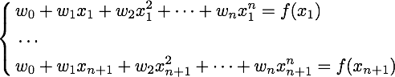

# Задание по программированию: Линейная алгебра: сходство текстов и аппроксимация функций

<h2> Линейная алгебра: сходство текстов и аппроксимация функций </h2> 

 Данное задание основано на материалах секции, посвященной введению в линейную алгебру. Вам понадобится компьютер с установленным интерпретатором Python и подключенными библиотеками NumPy и SciPy. 

<h3> Вы научитесь: </h3>
<ul>
	<li> читать тексты из файла с помощью Python и разбивать их на слова </li>
	<li> переводить тексты в векторные пространства, вычислять расстояния в этих пространствах </li>
	<li> решать системы линейных уравнений </li>
	<li> приближать любые функции с помощью многочленов </li>
</ul>
<h3> Введение </h3>

 В этом задании вы познакомитесь с некоторыми базовыми методами из линейной алгебры, реализованными в пакете SciPy — в частности, с методами подсчета косинусного расстояния и решения систем линейных уравнений. Обе эти задачи еще много раз встретятся нам в специализации. Так, на решении систем линейных уравнений основана настройка линейных моделей — очень большого и важного класса алгоритмов машинного обучения. Косинусное расстояние же часто используется в анализе текстов для измерения сходства между ними. 

<h3> Материалы </h3>

 Справка по функциям пакета scipy.linalg: http://docs.scipy.org/doc/scipy/reference/linalg.html 

 Справка по работе с файлами в Python: https://docs.python.org/2/tutorial/inputoutput.html#reading-and-writing-files 

 Справка по регулярным выражениям в Python (если вы захотите узнать про них чуть больше): https://docs.python.org/2/library/re.html 

<h3> Инструкция по выполнению </h3>

 Данное задание состоит из двух частей. В каждой ответом будет набор чисел, который вам нужно будет ввести в соответствующее поле через пробел. 

<h3><b> Задача 1: сравнение предложений </b></h3>

 Дан набор предложений, скопированных с Википедии. Каждое из них имеет "кошачью тему" в одном из трех смыслов: 

<ul>
	<li> кошки (животные) </li>
	<li> UNIX-утилита cat для вывода содержимого файлов </li>
	<li> версии операционной системы OS X, названные в честь семейства кошачьих </li>
</ul>

 Ваша задача — найти два предложения, которые ближе всего по смыслу к расположенному в самой первой строке. В качестве меры близости по смыслу мы будем использовать косинусное расстояние. 

<a href="sentences.txt" download="" title="sentences.txt">
	<button>ТУТЬ ФАЙЛ</button>
</a>

 Выполните следующие шаги: 

<ol>
	<li> Скачайте файл с предложениями (sentences.txt). </li>
	<li> Каждая строка в файле соответствует одному предложению. Считайте их, приведите каждую к нижнему регистру с помощью строковой функции lower(). </li>
	<li> Произведите токенизацию, то есть разбиение текстов на слова. Для этого можно воспользоваться регулярным выражением, которое считает разделителем любой символ, не являющийся буквой: re.split('[^a-z]', t). Не забудьте удалить пустые слова после разделения. </li>
	<li> Составьте список всех слов, встречающихся в предложениях. Сопоставьте каждому слову индекс от нуля до (d - 1), где d — число различных слов в предложениях. Для этого удобно воспользоваться структурой dict. </li>
	<li> Создайте матрицу размера n * d, где n — число предложений. Заполните ее: элемент с индексом (i, j) в этой матрице должен быть равен количеству вхождений j-го слова в i-е предложение. У вас должна получиться матрица размера 22 * 254. </li>
	<li> Найдите косинусное расстояние от предложения в самой первой строке (In comparison to dogs, cats have not undergone...) до всех остальных с помощью функции scipy.spatial.distance.cosine. Какие номера у двух предложений, ближайших к нему по этому расстоянию (строки нумеруются с нуля)? Эти два числа и будут ответами на задание. Само предложение (In comparison to dogs, cats have not undergone... ) имеет индекс 0. </li>
	<li> Запишите полученные числа в файл, разделив пробелом. Обратите внимание, что файл должен состоять из одной строки, в конце которой не должно быть переноса. Пример файла с решением вы можете найти в конце задания (submission-1.txt). </li>
	<li> Совпадают ли ближайшие два предложения по тематике с первым? Совпадают ли тематики у следующих по близости предложений? </li>
</ol>

 Разумеется, использованный вами метод крайне простой. Например, он не учитывает формы слов (так, cat и cats он считает разными словами, хотя по сути они означают одно и то же), не удаляет из текстов артикли и прочие ненужные слова. Позже мы будем подробно изучать анализ текстов, где выясним, как достичь высокого качества в задаче поиска похожих предложений. 

<h3><b> Задача 2: аппроксимация функции </b></h3>

 Рассмотрим сложную математическую функцию на отрезке [1, 15]: 

 f(x) = sin(x / 5) * exp(x / 10) + 5 * exp(-x / 2) 

 Она может описывать, например, зависимость оценок, которые выставляют определенному сорту вина эксперты, в зависимости от возраста этого вина. По сути, задача машинного обучения состоит в том, чтобы приблизить сложную зависимость с помощью функции из определенного семейства. В этом задании мы будем приближать указанную функцию с помощью многочленов. 

 Как известно, многочлен степени n (то есть w_0 + w_1 x + w_2 x^2 + ... + w_n x^n) однозначно определяется любыми n + 1 различными точками, через которые он проходит. Это значит, что его коэффициенты w_0, ... w_n можно определить из следующей системы линейных уравнений: 

 где через x_1, ..., x_n, x_{n+1} обозначены точки, через которые проходит многочлен, а через f(x_1), ..., f(x_n), f(x_{n+1}) — значения, которые он должен принимать в этих точках. 

 Воспользуемся описанным свойством, и будем находить приближение функции многочленом, решая систему линейных уравнений. 

<ol>
	<li> Сформируйте систему линейных уравнений (то есть задайте матрицу коэффициентов A и свободный вектор b) для многочлена первой степени, который должен совпадать с функцией f в точках 1 и 15. Решите данную систему с помощью функции scipy.linalg.solve. Нарисуйте функцию f и полученный многочлен. Хорошо ли он приближает исходную функцию? </li>
	<li> Повторите те же шаги для многочлена второй степени, который совпадает с функцией f в точках 1, 8 и 15. Улучшилось ли качество аппроксимации? </li>
	<li> Повторите те же шаги для многочлена третьей степени, который совпадает с функцией f в точках 1, 4, 10 и 15. Хорошо ли он аппроксимирует функцию? Коэффициенты данного многочлена (четыре числа в следующем порядке: w_0, w_1, w_2, w_3) являются ответом на задачу. Округлять коэффициенты не обязательно, но при желании можете произвести округление до второго знака (т.е. до числа вида 0.42) </li>
	<li> Запишите полученные числа в файл, разделив пробелами. Обратите внимание, что файл должен состоять из одной строки, в конце которой не должно быть переноса. Пример файла с решением вы можете найти в конце задания (submission-2.txt). </li>
</ol>
<a href="submission-2.txt" download="" title="submission-2.txt">
	<button>ТУТЬ ФАЙЛ</button>
</a>
 
<a href="submission-1.txt" download="" title="submission-1.txt">
	<button>ТУТЬ ФАЙЛ</button>
</a>